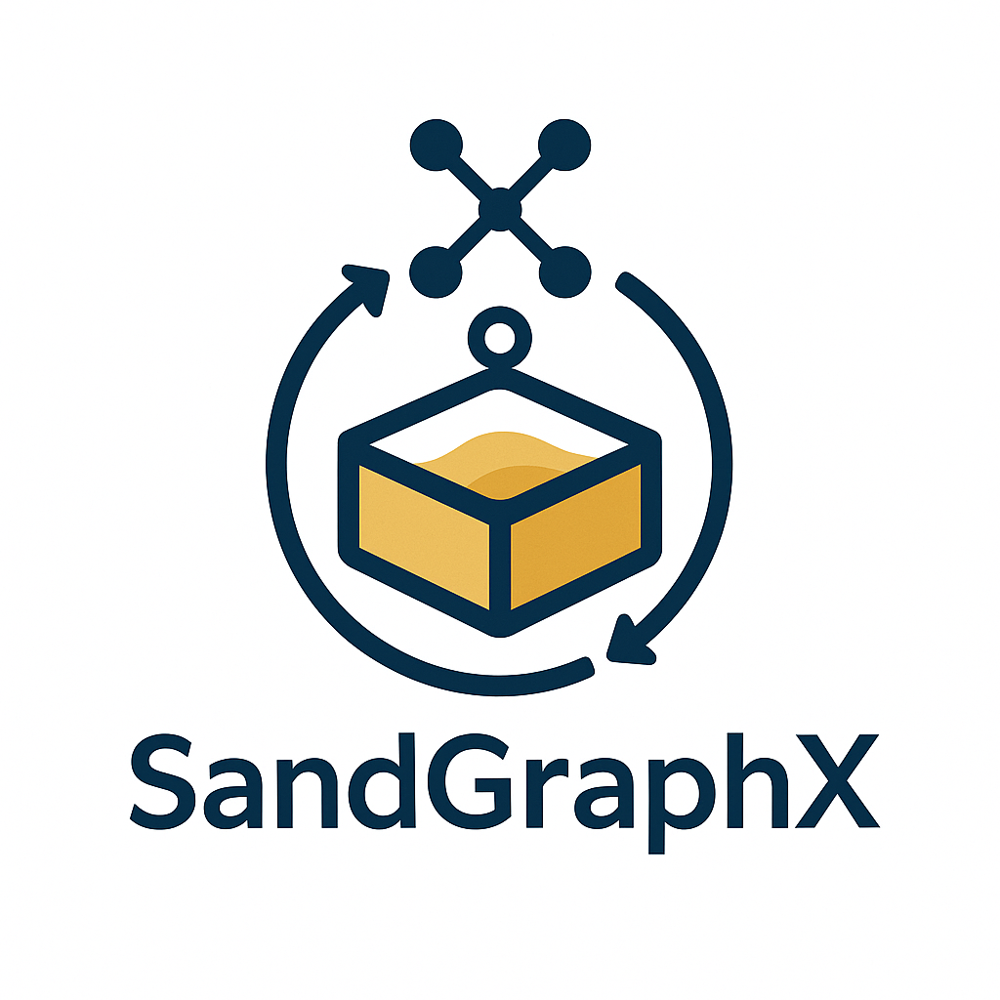
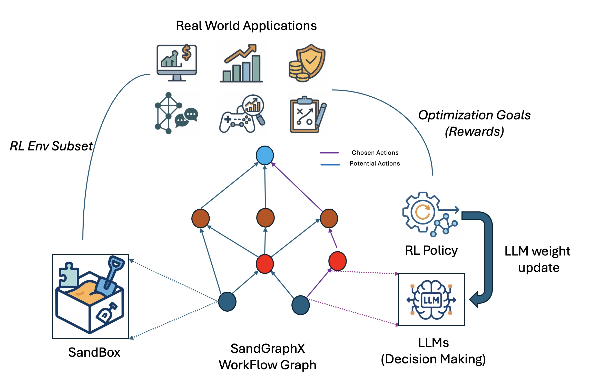

# SandGraphX

<div align="center">
  
</div>

SandGraphX 是一个基于环境子集（Environment Subsets）抽象和优化目标（Optimization Goal）的智能优化框架。它通过 SandBox Workflow Graph 来协调 LLM 决策和 并使用RL 对于LLM进行权重更新，实现复杂任务的自动化优化。

## 🌟 核心概念

### 1. 环境子集（Environment Subsets）
- 将复杂环境分解为可管理的子集
- 每个子集都是一个独立的 SandBox
- 支持自定义状态空间和动作空间
- 提供标准化的执行和评估接口

### 2. 优化目标（Optimization Goal）
- 定义任务的具体优化目标
- 可以是单一目标或多目标优化
- 支持自定义评分函数
- 提供目标达成度的量化评估

### 3. SandBox Workflow Graph
- 将任务分解为多个 SandBox 节点
- 通过有向无环图（DAG）组织节点关系
- 支持并行和串行执行
- 实现节点间的状态传递和结果聚合

### 4. 智能决策系统
- **RL 权重更新**：优化决策策略
- **状态管理**：追踪和更新系统状态
- **与LLM和资源分离交互**：SandBox作为workflow graph节点与LLM（计算）,RL(LLM Weight Update)和Computational Resources (GPU, CPU, etc)隔绝，SandGraphX对后两者全局托管。

<div align="center">
  
</div>

## 🌟 核心特性

- **官方MCP集成**：基于 Anthropic 的官方 MCP Python SDK
- **沙盒环境**：遵循 InternBootCamp 模式的标准化任务环境
- **工作流图**：支持Sandbox DAG Workflow
- **标准化通信**：使用官方 MCP 协议进行 Sandbox通信与LLM进行计算
- **多种使用场景**：从单一沙盒(single node)执行到复杂多阶段(multiple node, large DAGs)工作流
- **生态系统兼容**：与 Claude Desktop、Cursor、Windsurf 等 MCP 客户端兼容
- **动态工作流引擎**：支持复杂的DAG（有向无环图）工作流，实现多节点协作
- **智能状态管理**：每个节点维护独立的状态，支持动态更新和状态追踪
- **沙盒(SandBox)环境集成**：提供标准化的沙盒环境，用于任务执行和验证
- **资源管理系统**：资源（能量、令牌、时间、知识）管理机制
- **自适应决策**：支持基于历史信息和当前状态的智能决策
- **可扩展架构**：易于添加新的节点类型和功能模块

## 📁 文件结构

```
SandGraphX/
├── sandgraph/                    # 核心包目录
│   ├── core/                     # 核心功能模块
│   │   ├── workflow.py          # 基础工作流实现
│   │   ├── sg_workflow.py       # SandGraph工作流实现
│   │   ├── dag_manager.py       # DAG图管理
│   │   ├── llm_interface.py     # LLM接口
│   │   ├── sandbox.py           # 沙盒基础类
│   │   ├── rl_framework.py      # 强化学习框架
│   │   └── rl_algorithms.py     # 强化学习算法
│   ├── sandbox_implementations.py # 沙盒实现
│   └── examples.py              # 示例代码
├── demo/                        # 示例代码目录
│   ├── sandbox_optimization.py  # 沙盒优化示例
│   ├── trading_demo.py         # 交易系统示例
│   ├── sg_workflow_demo.py     # 工作流演示
│   ├── rl_demo.py              # 强化学习演示
│   ├── dag_sandbox_demo.py     # DAG沙盒演示
│   ├── dag_workflow_demo.py    # DAG工作流演示
│   ├── real_llm_demo.py        # 真实LLM演示
│   ├── demo.py                 # 基础演示
│   ├── interaction_demo.py     # 交互演示
│   ├── internbootcamp_demo.py  # InternBootcamp演示
│   ├── internbootcamp_mcp_server.py # InternBootcamp MCP服务器
│   └── mcp_server_example.py   # MCP服务器示例
└── setup.py                     # 安装配置
```

## 🏗️ 系统架构

```
┌───────────────────────────────────────────────────────┐
│                      SandGraph Core                   │
├─────────────┬─────────────┬─────────────┬─────────────┤
│  Workflow   │   SandBox   │    LLM      │     RL      │
│   Engine    │  Manager    │  Manager    │  Manager    │
└──────┬──────┴──────┬──────┴──────┬──────┴──────┬──────┘
       │             │             │             │
       ▼             ▼             ▼             ▼
┌─────────────┐ ┌─────────────┐ ┌─────────────┐ ┌─────────────┐
│  DAG Nodes  │ │ Environment │ │  Decision   │ │  Weight     │
│             │ │  Subsets    │ │  Making     │ │  Updates    │
└─────────────┘ └─────────────┘ └─────────────┘ └─────────────┘
       │             │             │             │
       └─────────────┴─────────────┴─────────────┘
                      │
                      ▼
┌─────────────────────────────────────────────────────────┐
│                    SandGraphX Manager                   │
├─────────────────────────────────────────────────────────┤
│  • 用户输入：环境子集定义和优化目标                          │
│  • 工作流：DAG图构建与执行管理                              │
│  • 优化：LLM决策优化与RL权重更新                            │
│  • 资源：全局资源管理与SandBox隔离                          │
│  • 监控：执行状态追踪与性能分析                              │
│  • 扩展：支持自定义节点和优化策略                            │
└─────────────────────────────────────────────────────────┘
```

### 架构说明

1. **核心层**
   - Workflow Engine: 管理工作流执行和节点调度
   - SandBox Manager: 管理环境子集和状态转换
   - LLM Manager: 处理决策生成和策略优化
   - RL Manager: 负责权重更新和策略改进

2. **节点层**
   - DAG Nodes: 工作流中的计算节点
   - Environment Subsets: 环境子集实现
   - Decision Making: LLM决策节点
   - Weight Updates: RL权重更新节点

3. **管理层**
   - 用户输入处理：接收环境子集定义和优化目标
   - 工作流管理：构建和执行DAG图
   - 优化控制：协调LLM和RL的优化过程
   - 资源隔离：确保SandBox与全局资源分离
   - 状态监控：追踪执行状态和性能指标
   - 扩展支持：提供自定义节点和策略的接口

## 🚀 快速开始

### 1. 定义环境子集
```python
from sandgraph import SandBox

class MyEnvironment(SandBox):
    def __init__(self):
        super().__init__()
        self.state_space = {...}  # 定义状态空间
        self.action_space = {...}  # 定义动作空间
    
    def execute(self, action):
        # 实现环境执行逻辑
        return next_state, reward, done
    
    def get_state(self):
        # 返回当前状态
        return self.current_state
```

### 2. 定义优化目标
```python
def optimization_goal(state, action, next_state):
    # 实现优化目标函数
    score = calculate_score(state, action, next_state)
    return score
```

### 3. 创建工作流
```python
from sandgraph import SG_Workflow, NodeType

# 创建LLM管理器
llm_manager = create_shared_llm_manager("my_llm")

# 创建工作流
workflow = SG_Workflow("my_workflow", WorkflowMode.TRADITIONAL, llm_manager)

# 添加节点
workflow.add_node(NodeType.SANDBOX, "env", {"sandbox": MyEnvironment()})
workflow.add_node(NodeType.LLM, "decision", {"role": "决策器"})
workflow.add_node(NodeType.RL, "optimizer", {"algorithm": "PPO"})

# 连接节点
workflow.add_edge("env", "decision")
workflow.add_edge("decision", "optimizer")
workflow.add_edge("optimizer", "env")

# 执行工作流
result = workflow.execute_full_workflow()
```

## 📦 安装

### 使用 Conda 安装（推荐）

```bash
# 1. 创建新的 conda 环境
conda create -n sandgraph python=3.11
conda activate sandgraph

# 2. 克隆仓库
git clone https://github.com/NoakLiu/sandgraph.git
cd sandgraph

# 3. 运行安装脚本
chmod +x quick_install.sh
./quick_install.sh
```

<!-- ### 验证安装

```bash
# 验证 MCP SDK
python -c "from mcp.server.fastmcp import FastMCP; print('MCP SDK 安装成功')"

# 验证 SandGraph
python -c "from sandgraph import check_mcp_availability; print(check_mcp_availability())"
``` -->

<!-- ### 注意事项

1. 确保使用 Python 3.8 或更高版本
2. 建议使用 conda 环境以避免依赖冲突
3. 如果遇到权限问题，请确保使用虚拟环境而不是 root 用户
4. 安装完成后，每次使用前都需要激活环境：`conda activate sandgraph`

## 📚 示例场景

### 1. 游戏分析系统
- 状态分析
- 策略生成
- 风险评估
- 资源优化

### 2. 动态决策系统
- 状态分析
- 策略生成
- 风险评估
- 决策执行

### 3. 量化交易系统
- 市场数据分析
- 交易策略生成
- 实时交易执行
- 风险控制
- 投资组合管理

### 4. 社交网络分析
- 信息传播建模
- 影响力分析
- 社区发现
- 趋势预测

## 🔧 开发指南

### 添加新节点类型
1. 定义节点属性
2. 实现状态更新逻辑
3. 注册到工作流系统

### 自定义工作流
1. 定义节点结构
2. 设置节点依赖
3. 配置执行参数 -->

## 📄 许可证

MIT License

## 🤝 联系方式

- 邮件联系 - dong.liu.dl2367@yale.edu
