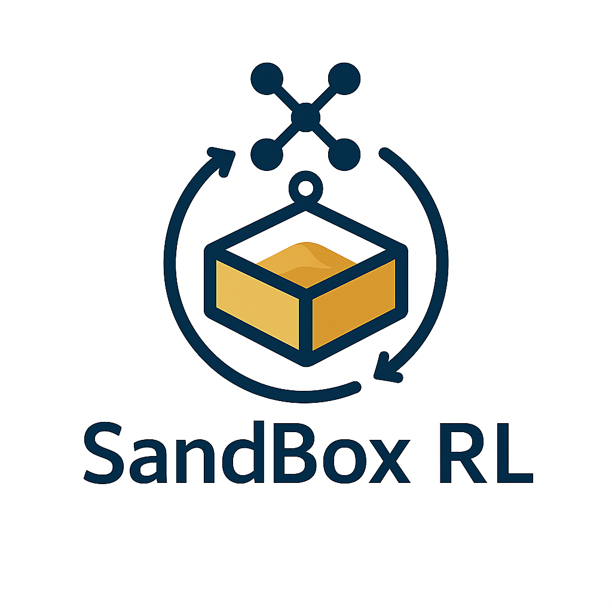

# Sandbox-RLX

<div align="center">
  
</div>

Sandbox-RLX 是一个基于环境子集（Environment Subsets）抽象和优化目标（Optimization Goal）的智能优化框架。它通过 SandBox Workflow Graph 来协调 LLM 决策和 RL 权重更新，实现复杂任务的自动化优化。

## 🌟 核心概念

### 1. 环境子集（Environment Subsets）
- 将复杂环境分解为可管理的子集
- 每个子集都是一个独立的 SandBox
- 支持自定义状态空间和动作空间
- 提供标准化的执行和评估接口

### 2. 优化目标（Optimization Goal）
- 定义任务的具体优化目标
- 可以是单一目标或多目标优化
- 支持自定义评分函数
- 提供目标达成度的量化评估

### 3. SandBox Workflow Graph
- 将任务分解为多个 SandBox 节点
- 通过有向无环图（DAG）组织节点关系
- 支持并行和串行执行
- 实现节点间的状态传递和结果聚合

### 4. 智能决策系统
- **RL 权重更新**：优化决策策略
- **状态管理**：追踪和更新系统状态
- **与LLM和资源分离交互**：SandBox作为workflow graph节点与LLM(Decision Making),RL(LLM Weight Update)和Computational Resources(GPU, CPU, etc)隔绝，Sandbox-RLX对后两者全局托管。

<div align="center">
  
</div>

## 🌟 核心特性

- **沙盒环境**：遵循 InternBootCamp 模式的标准化任务环境
- **工作流图**：支持Sandbox DAG Workflow
- **标准化通信**：使用官方 MCP 协议进行 Sandbox通信与LLM进行计算
- **多种使用场景**：从单一沙盒(single node)执行到复杂多阶段(multiple node, large DAGs)工作流
- **动态工作流引擎**：支持复杂的DAG（有向无环图）工作流，实现多节点协作
- **智能状态管理**：每个节点维护独立的状态，支持动态更新和状态追踪
- **资源管理系统**：资源（能量、令牌、时间、知识）管理机制
- **自适应决策**：支持基于历史信息和当前状态的智能决策
- **可扩展架构**：易于添加新的节点类型和功能模块
- **🔥 丰富的LLM模型支持**：支持多种火热的大语言模型，包括：
  - **默认推荐**：Mistral-7B
  - **中文模型**：Qwen-7B, Yi-6B, ChatGLM3
  - **代码模型**：CodeLLaMA, StarCoder
  - **轻量级**：Phi-2, Gemma-2B
  - **高性能**：LLaMA2-13B
  - **开源替代**：GPT-2, Falcon

## 📁 文件结构

```
Sandbox-RLX/
├── sandgraph/                    # 核心包目录
│   ├── core/                     # 核心功能模块
│   │   ├── workflow.py          # 基础工作流实现
│   │   ├── sg_workflow.py       # Sandbox-RL工作流实现
│   │   ├── dag_manager.py       # DAG图管理
│   │   ├── llm_interface.py     # LLM接口
│   │   ├── sandbox.py           # 沙盒基础类
│   │   ├── rl_framework.py      # 强化学习框架
│   │   └── rl_algorithms.py     # 强化学习算法
│   ├── sandbox_implementations.py # 沙盒实现
│   └── examples.py              # 示例代码
├── demo/                        # 示例代码目录
│   ├── trading_demo.py         # 交易系统示例
│   ├── social_network_demo.py  # 社交网络分析演示
│   ├── misinformation_spread_demo.py # 虚假信息传播演示
│   └── oasis_social_demo.py    # OASIS社交网络模拟
└── setup.py                     # 安装配置
```

## 🏗️ 系统架构

```
┌───────────────────────────────────────────────────────┐
│                      Sandbox-RL Core                   │
├─────────────┬─────────────┬─────────────┬─────────────┤
│  Workflow   │   SandBox   │    LLM      │     RL      │
│   Engine    │  Manager    │  Manager    │  Manager    │
└──────┬──────┴──────┬──────┴──────┬──────┴──────┬──────┘
       │             │             │             │
       ▼             ▼             ▼             ▼
┌─────────────┐ ┌─────────────┐ ┌─────────────┐ ┌─────────────┐
│  DAG Nodes  │ │ Environment │ │  Decision   │ │  Weight     │
│             │ │  Subsets    │ │  Making     │ │  Updates    │
└─────────────┘ └─────────────┘ └─────────────┘ └─────────────┘
       │             │             │             │
       └─────────────┴─────────────┴─────────────┘
                      │
                      ▼
┌─────────────────────────────────────────────────────────┐
│                    Sandbox-RLX Manager                   │
├─────────────────────────────────────────────────────────┤
│  • 用户输入：环境子集定义和优化目标                          │
│  • 工作流：DAG图构建与执行管理                              │
│  • 优化：LLM决策优化与RL权重更新                            │
│  • 资源：全局资源管理与SandBox隔离                          │
│  • 监控：执行状态追踪与性能分析                              │
│  • 扩展：支持自定义节点和优化策略                            │
└─────────────────────────────────────────────────────────┘
```

## 🚀 快速开始

### 1. 定义环境子集
```python
from sandgraph import SandBox

class MyEnvironment(SandBox):
    def __init__(self):
        super().__init__()
        self.state_space = {...}  # 定义状态空间
        self.action_space = {...}  # 定义动作空间
    
    def execute(self, action):
        # 实现环境执行逻辑
        return next_state, reward, done
    
    def get_state(self):
        # 返回当前状态
        return self.current_state
```

### 2. 定义优化目标
```python
def optimization_goal(state, action, next_state):
    # 实现优化目标函数
    score = calculate_score(state, action, next_state)
    return score
```

### 3. 创建工作流
```python
from sandbox_rl.core.llm_interface import create_shared_llm_manager
from sandbox_rl.core.sg_workflow import SG_Workflow, WorkflowMode
from sandbox_rl.core.rl_algorithms import RLTrainer, RLConfig

# 创建LLM管理器（默认使用Mistral-7B）
llm_manager = create_shared_llm_manager("mistralai/Mistral-7B-Instruct-v0.2")

# 创建工作流
workflow = SG_Workflow("my_workflow", WorkflowMode.TRADITIONAL, llm_manager)

# 添加节点
workflow.add_node(NodeType.SANDBOX, "env", {"sandbox": MyEnvironment()})
workflow.add_node(NodeType.LLM, "decision", {"role": "决策器"})
workflow.add_node(NodeType.RL, "optimizer", {"algorithm": "PPO"})

# 连接节点
workflow.add_edge("env", "decision")
workflow.add_edge("decision", "optimizer")
workflow.add_edge("optimizer", "env")

# 执行工作流
result = workflow.execute_full_workflow()
```

## 📦 安装

### 使用 Conda 安装（推荐）

```bash
# 1. 创建新的 conda 环境
conda create -n sandgraph python=3.11
conda activate sandgraph

# 2. 克隆仓库
git clone https://github.com/NoakLiu/Sandbox-RLX.git
cd Sandbox-RLX

# 3. 运行安装脚本
chmod +x quick_install.sh
./quick_install.sh
```

## 📖 Usage

### System Architecture & API Flow

```
┌─────────────────────────────────────────────────────────┐
│                    User Application                     │
└─────────────────────┬───────────────────────────────────┘
                      │
                      ▼
┌─────────────────────────────────────────────────────────┐
│                 Sandbox-RLX Manager                      │
│  ┌─────────────┬─────────────┬─────────────┬─────────┐  │
│  │  Workflow   │   SandBox   │    LLM      │   RL    │  │
│  │   Engine    │  Manager    │  Manager    │ Manager │  │
│  │ (sg_workflow│ (sandbox.py)│(llm_interface│(rl_algorithms│
│  │    .py)     │             │    .py)     │   .py)  │  │
│  └──────┬──────┴──────┬──────┴──────┬──────┴────┬────┘  │
│         │             │             │           │       │
│         ▼             ▼             ▼           ▼       │
│  ┌─────────────┐ ┌─────────────┐ ┌─────────┐ ┌───────┐  │
│  │  DAG Nodes  │ │ Environment │ │ Decision│ │Weight │  │
│  │             │ │  Subsets    │ │ Making  │ │Updates│  │
│  └─────────────┘ └─────────────┘ └─────────┘ └───────┘  │
└─────────────────────────────────────────────────────────┘
                      │
                      ▼
┌─────────────────────────────────────────────────────────┐
│                   Execution Results                     │
│  • Performance Metrics                                  │
│  • Optimization Statistics                              │
│  • State Updates                                        │
└─────────────────────────────────────────────────────────┘
```

### Core API Usage

```python
from sandbox_rl.core.llm_interface import create_shared_llm_manager
from sandbox_rl.core.sg_workflow import SG_Workflow, WorkflowMode
from sandbox_rl.core.rl_algorithms import RLTrainer, RLConfig

# 1. Initialize Core Components (默认使用Mistral-7B)
llm_manager = create_shared_llm_manager(
    model_name="mistralai/Mistral-7B-Instruct-v0.2",  # 默认模型
    backend="huggingface",
    temperature=0.7
)

# 2. Create Workflow & RL Trainer
workflow = SG_Workflow("my_workflow", WorkflowMode.TRADITIONAL, llm_manager)
rl_trainer = RLTrainer(RLConfig(algorithm="PPO"), llm_manager)

# 3. Add Environment & Decision Nodes
workflow.add_node(NodeType.SANDBOX, "environment", {"sandbox": MySandbox()})
workflow.add_node(NodeType.LLM, "decision", {"role": "决策器"})

# 4. Execute & Optimize
result = workflow.execute_full_workflow()
rl_trainer.update_policy()
```

### Example 1: Trading System

**Input**: Market data, portfolio state, trading parameters  
**Process**: LLM analyzes market → generates trading decisions → RL optimizes strategy  
**Output**: Trading actions, performance metrics, optimized weights

```python
# Run trading demo
python demo/trading_demo.py --strategy simulated --steps 5
```

### Example 2: Social Network Analysis

**Input**: Network topology, user interactions, content data  
**Process**: LLM analyzes patterns → generates insights → RL optimizes recommendations  
**Output**: Network insights, user recommendations, engagement metrics

```python
# Run social network demo
python demo/social_network_demo.py --steps 10
```

### Example 3: Misinformation Spread Analysis

**Input**: Social network data, user beliefs, information content  
**Process**: LLM analyzes misinformation patterns → generates intervention strategies → RL optimizes intervention effectiveness  
**Output**: Intervention actions, belief change metrics, spread reduction statistics

```python
# Run misinformation spread demo
python demo/misinformation_spread_demo.py --steps 5
```

### Example 4: OASIS Social Network Simulation

**Input**: User profiles, social network topology, content data  
**Process**: LLM analyzes social dynamics → generates user behaviors → RL optimizes engagement strategies  
**Output**: Social interactions, network growth metrics, engagement optimization

```python
# Run OASIS social network demo
python demo/oasis_social_demo.py --steps 5
```

## 🔥 LLM模型支持

Sandbox-RL支持多种主流大语言模型，以下是支持的模型和基本使用方法：

### 支持的模型

| 模型类型 | 推荐模型 | 参数大小 | 内存需求 |
|---------|---------|---------|---------|
| **默认推荐** | **Mistral-7B** | 7B | 8-16GB |
| **中文模型** | Qwen-7B, Yi-6B, ChatGLM3 | 6-7B | 8-16GB |
| **代码模型** | CodeLLaMA, StarCoder | 7-15B | 8-16GB |
| **轻量级** | Phi-2, Gemma-2B | 2-3B | 2-4GB |
| **高性能** | LLaMA2-13B | 13B | 16-32GB |
| **开源替代** | GPT-2, Falcon | 1-7B | 2-16GB |


<!-- 设计更多的指标和接口 (Social Network) - 用户过程查看 (WanDB, TensorBoard)
LLMs frozen & adaptive update
Demo的最终目的设计，Sandbox-RL LLM要 beat普通的规则和人类用户，最后的结果应该是misinformation spread over large percent of graph. -->

## 📄 许可证

MIT License

## 🤝 联系方式

- 邮件联系 - dong.liu.dl2367@yale.edu 

## 🧪 典型案例：虚假信息传播对抗仿真

我们提供了一个基于 Sandbox-RL + OASIS 的 misinformation 传播对抗实例，模拟了两组用户（如“特朗普总统支持者” vs “拜登总统支持者”）在社交网络中的错误信息传播竞争。你可以通过如下方式运行：

1. 进入 scripts 目录，运行仿真脚本：

```bash
cd demo/scripts
python misinformation_spread_demo.py
```

2. 该脚本会自动模拟两组用户的观点传播，并可视化每轮“特朗普/拜登”观点的占比变化。

3. 详细用法、参数配置和高级功能（如 RL 策略、LLM frozen/adaptive、干预机制等）请参考 OASIS 文档：

👉 [OASIS Misinformation Spread Demo 使用说明](demo/oasis/docs/misinformation_spread_demo.md)

--- 